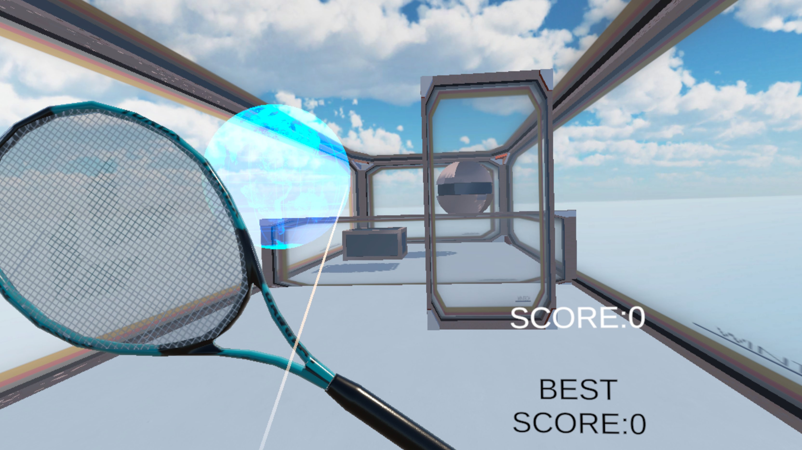

# 🎾 VR Zero Gravity Tennis 

無重力空間のコートで、ボールをラケットで弾き、Goal に当ててハイスコアを目指す VR ゲームです。  
Goalするごとにボールの速度は大きくなり、難易度が上がります。
Out に触れるとボールは初期位置へリセットされ、演出・効果音が再生されます。

 
▶️ **デモ動画**: (Demo/video.mp4) 
---

## 🎮 遊び方 / How to Play

- VR コントローラーでラケット（`tennis_bat`）を掴んでボールを弾き返します。
- Goal(奥の壁) に当てるとスコア +1、ボールが加速します。エフェクトが表示され、効果音が再生されます。
- Out(手前の壁) に触れるとゲームオーバーです。エフェクトが表示されます。

---

## 📂 プロジェクト構成 / Project Structure

```text
Assets/
├─ Scenes/ … メインシーン
├─ Scripts/ … ゲームロジック
├─ XR/ … XR Plugin Management 設定
├─ XRI/ … XRI 設定
├─ Samples/ … XR Interaction Toolkit / Starter Assets /
├─ Art/ … モデルや素材
├─ ProjectSettings/
├─ Packages/
└─ README.md … このファイル
```
---

## 📦 依存ソフト / Requirements

- Unity 6.0 (6000.0.50f1)
- XR Interaction Toolkit 3.0.8+（Starter Assets 推奨）
- XR Plugin Management（OpenXR を有効）

---


